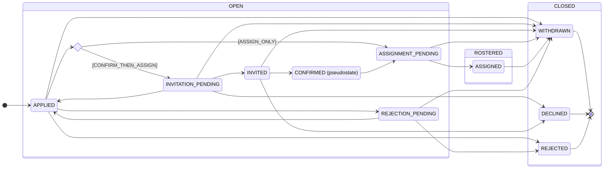

# Application Lifecycle

This diagram shows the finite state machine for the status of an application.

```mermaid
stateDiagram-v2
    direction LR
    [*] --> APPLIED
    state OPEN {
        state application_kind <<choice>>
        APPLIED --> application_kind
        application_kind --> INVITATION_PENDING: [CONFIRM_THEN_ASSIGN]
        application_kind --> ASSIGNMENT_PENDING: [ASSIGN_ONLY]
        APPLIED --> REJECTION_PENDING
        APPLIED --> REJECTED
        APPLIED --> WITHDRAWN
        INVITATION_PENDING --> APPLIED
        INVITATION_PENDING --> INVITED
        INVITATION_PENDING --> DECLINED
        INVITATION_PENDING --> WITHDRAWN
        INVITED --> CONFIRMED
        INVITED --> DECLINED
        INVITED --> WITHDRAWN
        CONFIRMED --> ASSIGNMENT_PENDING
        state "CONFIRMED (pseudostate)" as CONFIRMED
        ASSIGNMENT_PENDING --> ASSIGNED
        ASSIGNMENT_PENDING --> WITHDRAWN
    }
    state ROSTERED {
        ASSIGNED --> WITHDRAWN
    }
    REJECTION_PENDING --> APPLIED
    REJECTION_PENDING --> REJECTED
    REJECTION_PENDING --> WITHDRAWN
    state CLOSED {
        WITHDRAWN --> [*]
        DECLINED --> [*]
        REJECTED --> [*]
    }
```

