# Staffing Events

Stave's staffing capabilities are designed to work with your process. The most important thing to know is that **Stave will not send communications to applicants until you ask it to do so**.

Do you prefer to draft your crews before you send out invitations? Send invitations in waves? Staff a few key positions first and build crews around them? All of these workflows are possible in Stave.

<iframe src="https://www.youtube-nocookie.com/embed/QYll774ke7w?si=y7KyvCiEe2MfY7UJ" title="Staffing Games" frameborder="0" allow="accelerometer; autoplay; clipboard-write; encrypted-media; gyroscope; picture-in-picture; web-share" referrerpolicy="strict-origin-when-cross-origin" allowfullscreen></iframe>
<iframe src="https://www.youtube-nocookie.com/embed/f4whVACtDYs?si=uBZreTzTa3zOPqEe" title="Staffing Tournaments" frameborder="0" allow="accelerometer; autoplay; clipboard-write; encrypted-media; gyroscope; picture-in-picture; web-share" referrerpolicy="strict-origin-when-cross-origin" allowfullscreen></iframe>

## Application Processes

Stave offers two _application processes_, which you can choose for each Application Form independently.

### Assign Only

This process is typically used by smaller events. Applicants receive a schedule email when they are staffed. There is no invitation or confirmation process. The process looks like this:

```mermaid
flowchart LR
    A(Applied) --> B(Assignment Pending)
    A --> C(Rejection Pending)
    C -->|✉️ Email| F(Rejected)
    B -->|✉️ Email| Z(Assigned)
```

### Confirm, then Assign

This process is typically used by larger events and tournaments. Applicants are sent an invitation email when they are accepted and are asked to confirm or decline their participation. If they confirm, they receive a schedule email when they are staffed. The process looks like this:

```mermaid
flowchart LR
    A(Applied) --> B(Invitation Pending)
    A --> C(Rejection Pending)
    C -->|✉️ Email| F(Rejected)
    B -->|✉️ Email| E(Invited)
    E --> G(Confirmed)
    G --> Q(Assignment Pending)
    Q -->|✉️ Email| Z(Assigned)
    E --> J(Declined)
```

## Viewing Applications

The Applications page shows you all of the applications you've received. Applications are grouped into categories based on what action you made need to take on them.

Open
: applications that require your action: no decision has been made.

In Progress
: applications where a staffing decision has been made but not yet sent to the applicant, or, in the "Confirm, then Assign" process, applications that have received a confirmation but not an assignment.

Staffed
: applications where a staffing decision has been made and communicated to the applicant.

Closed
: applications that will not be staffed and whose status has been communicated to the applicant.

On the Applications page, you can mark applicants to be invited by clicking the ✉️ button, or to be declined by clicking the ❌ button. Stave tracks your decisions by updating the status of the application, but does not send any communications until you choose to do so ([Sending Communications](#sending-communications)).

> [!NOTE]
> You aren't required to process your applications this way. It's one option you can use. See also [Crew Builder](#crew-builder).

Click the **View** button for any application to see all of the application data on one page. The application page also provides more options for updating the status of the application. For example, if you receive a personal message that an applicant wishes to withdraw, you can mark their application Withdrawn. If you marked an application for invitation or to be declined and want to change your mind, you can send it back to Applied status.

If you've taken action on an application, you can have Stave send communications to the applicant by clicking (for example) **Send Invitation Now**. Stave will use the default message template for the communication type; if you don't have message templates selected for this Application Form, you won't be able to use Send Now. If you're not using templates or if you'd like to edit the message first, click **Customize Invitation Now**.

Applicants can update their own applications. If, for example, an applicant chooses to withdraw, you'll see their application move to the Closed section.

## Crew Builder

Crew Builder is where you marshal your applicants into the Roles and Role Groups assigned to your Application Form.

Crew Builder presents you with a grid of staffable Roles for each Game. To staff a Role, click the 🔍 button next to its name. Note that Stave calls out the number of applicants for that role and how many are still available.

Stave shows you a table of applicants; click the Select button to place an applicant in the Role, or View to drill down into the application details. You'll only see applicants whose availability includes this Game or time slot, who applied for this Role, and who aren't already assigned in a conflicting Role.

> [!NOTE]
> You can assign one applicant to multiple Roles in the same Role Group and Game if the Roles are marked Non-Exclusive. For example, the HNSO Role is Non-Exclusive, so you can make one applicant HNSO and PLT for the same Game. You can't mix and match across Role Groups, though: the HNSO cannot also be a JR.

When you staff an applicant, Stave automatically moves their Application forward. For the "Confirm, then Assign" process, the Application is marked Invitation Pending (if it's in Applied status), or Assignment Pending if it's already Confirmed. For the "Assign Only" process, the Application is marked Assignment Pending. If you remove an applicant from your crews, Stave will move the Application backwards.

Stave never sends communications to applicants until you do so ([Sending Communications](#sending-communications)). Changes you make in Crew Builder, like decisions you record on the Applications page, are tracked by Stave and sent out at your discretion in Comm Center.

### Static Crews

When you have multiple Games in an Event, you may choose to build Static Crews. Static Crews assign applicants to Roles in a specific Role Group, and can then be assigned as a unit to one or more Games.

Click the Add Crew button for the Role Group for which you need a Static Crew. You can then staff the crew just like you do a single Game. Once your crew is staffed, you can assign it to Games by clicking the button with its name. Any Roles that are not staffed in the Static Crew can be staffed on a per-Game basis. If you need to override a Role staffed by a Static Crew, click the ⬇️ Override button.

## Sending Communications

Once you've made decisions about any of your Applications, you can start sending communications to your applicants.

> [!NOTE]
> Outbound emails from Stave come from the email address `stave@stave.app`. Applicants can add this email address to their address book to avoid having messages routed to Spam.

Stave messages are written in Markdown format, which looks like plain text. You can use _merge fields_ to add information from the Event, League, Application, Application Form, applicant profile, and your own profile. Read [Messaging](./messaging.md) to learn about writing Stave messages.

### Types of Email

Stave recognizes four types of email you can send.

Invitation Emails
: Invitation emails are only used in the Confirm, then Assign process. They invite the applicant to participate, and provide a link where the applicant can confirm or decline. When you send an invitation email to an applicant, the Application's status is updated to Invited.

Rejection Emails
: Rejection emails are used in both processes. They inform the applicant that they won't be staffed. When you send a rejection email to an applicant, the Application's status is updated to Rejected.

Assignment Emails
: Assignment emails are used in both processes. They inform the applicant that they have been staffed with a specific schedule and provide a link where they can view their assignments in Stave. WHen you send an assignment email to an applicant, the Application's status is updated to Assigned. Applicants who are Assigned can view the staffing schedule in Stave.

Crew Emails
: Crew emails are independent of application process. Once you've staffed your crews, you can send crew emails to provide them updates and other information. Crew emails only go to applicants who are already Assigned. They don't change the status of the Application.

### Sending Single Communications

You can send communication to a single applicant at any time from their application, as described in [Viewing Applications](#viewing-applications).

### Sending Bulk Communications

The Comm Center lets you send communication to groups of applicants all at once. Comm Center will only offer you controls to send communications that you've queued up via actions on the Crew Builder or Applications pages. For example, if you haven't marked any applications to be rejected, you won't get the option to send rejection emails; invitation emails will only be available on Application Forms that use the "Confirm, then Assign" process.

Invitation, rejection, and assignment emails can be sent with or without using a Message Template. Message Templates let you send personalized emails with applicant-specific data automatically inserted (a mail merge), and allow you to use standardized communications across Events. See [League Management](./league-management.md#message-templates) for more on creating Message Templates.

Message Templates are assigned on the [Application Form](./build-events-and-forms.md). If your Application Form has templates assigned, you'll see Send Email buttons in Comm Center. Click that button to automatically template and send emails to **all applicants in the appropriate status**. Invitation emails go to all applications whose status is Pending Invitation. Rejection emails go to all applications whose status is Pending Rejection. And assignment emails go to all applications whose status is Pending Assignment.

To customize the text or audience for your communication, click Customize Emails. (If you do not have Message Templates configured, this will be your only choice). When you customize emails, Stave presents you with a list of potential recipients. You can choose one or multiple recipients to contact, _without_ notifying the others. You can also customize the text of your emails, or write a new message from scratch. When you're ready to send messages to the recipients you've selected, click the Send button.

Crew emails are always customized, as there are no Message Templates for crew emails.

> [!NOTE]
> Stave sends emails in the background, and retries any messages that fail to send. Most messages are delivered in a few minutes.
